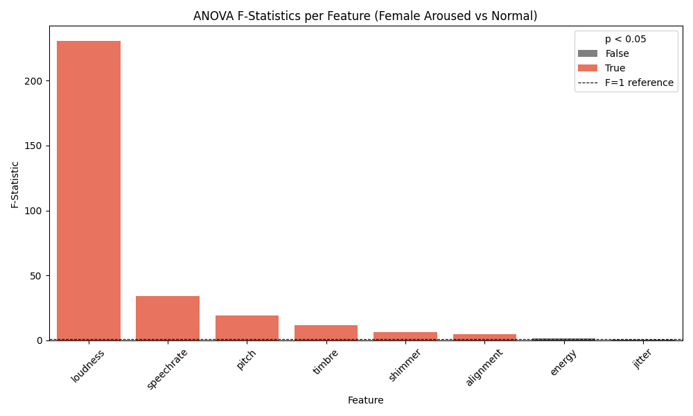
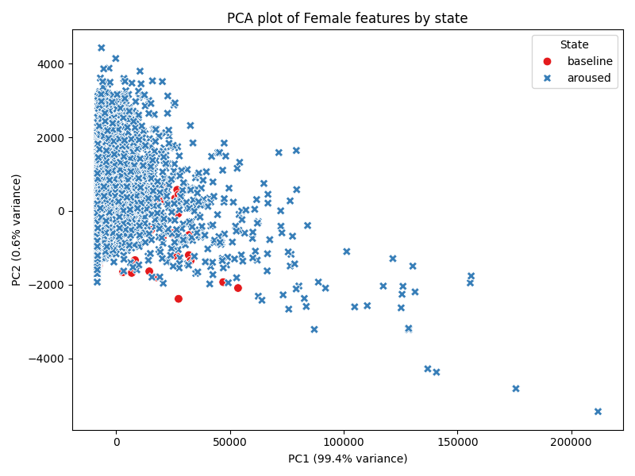
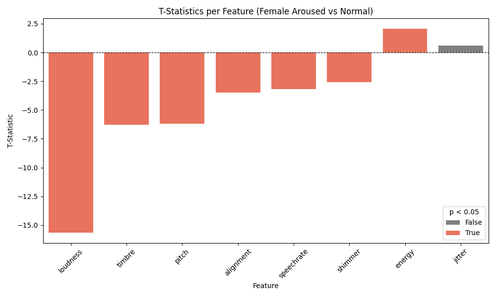
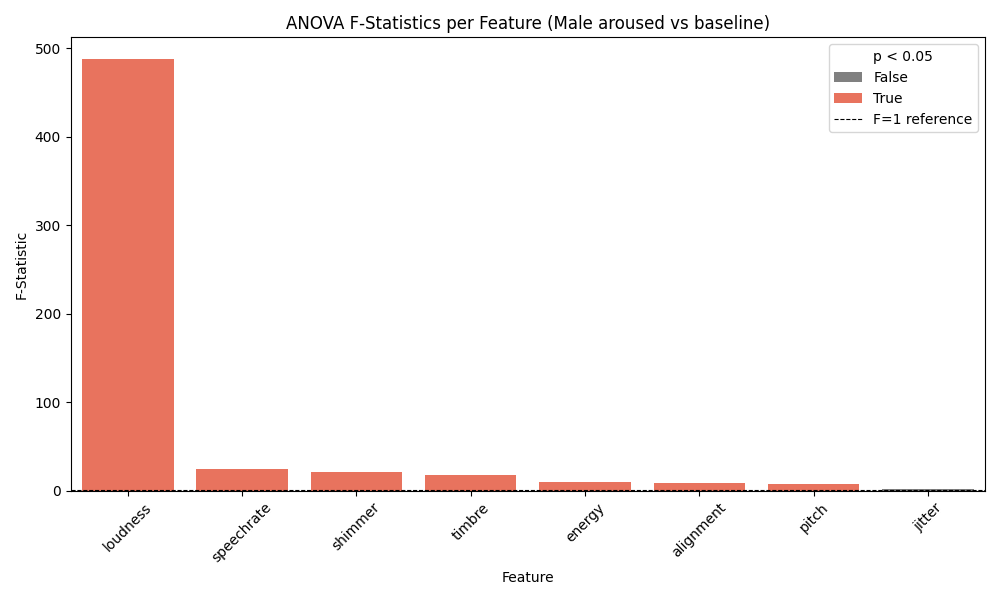
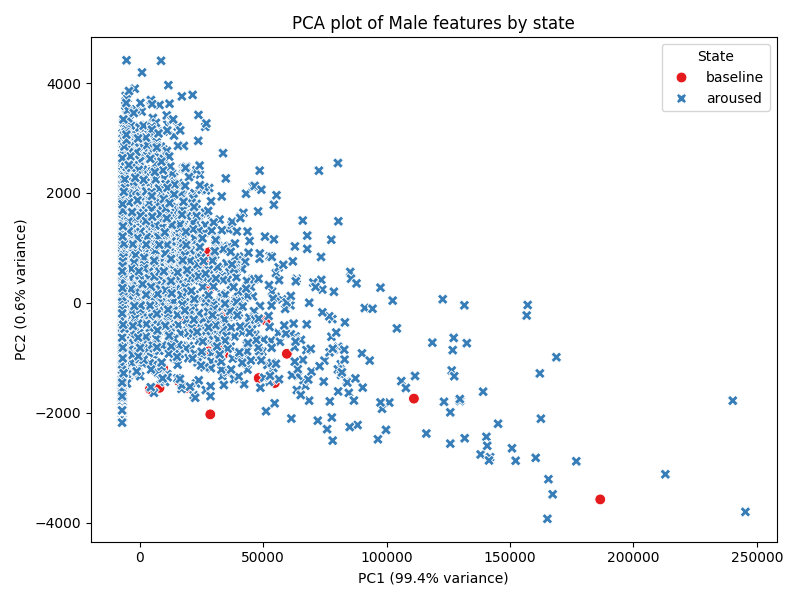
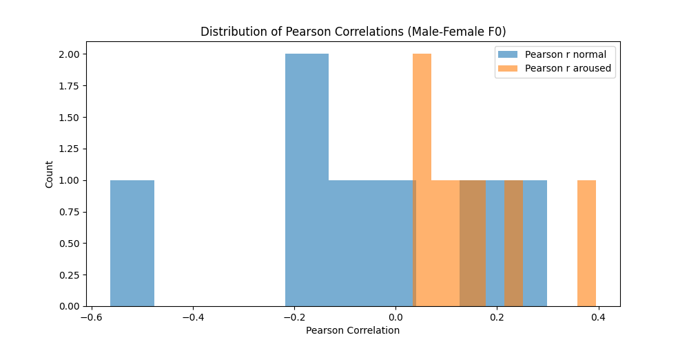
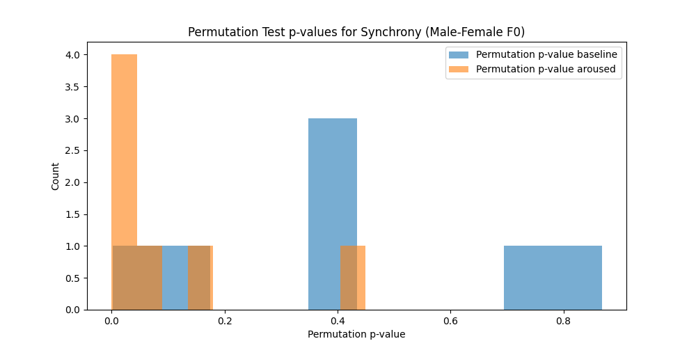
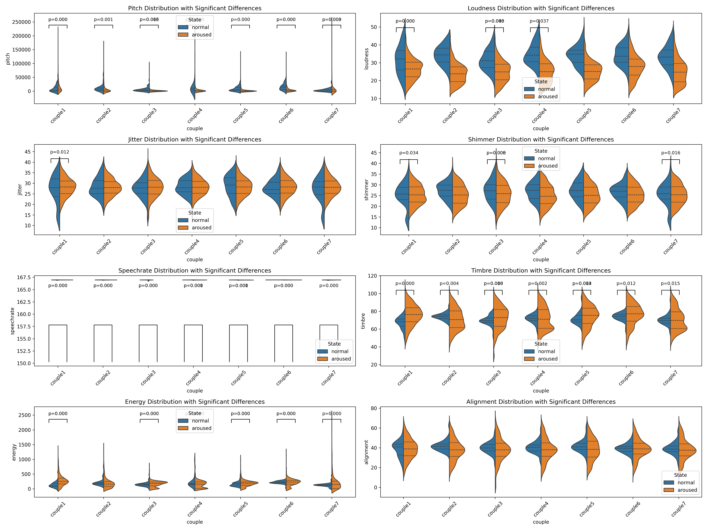
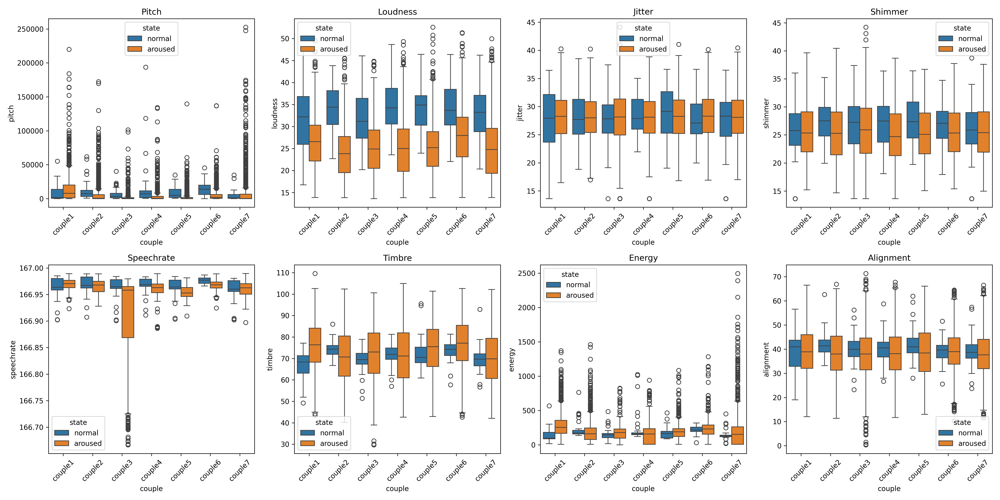

# Vocal Synchrony Data Tool: Complete Project Overview and Results

This project provides a modular, Python-based toolkit for analyzing vocal synchrony and acoustic features (pitch, loudness, timbre, etc.) across emotional states (baseline/baseline vs. aroused), with both individual and dyadic (synchrony) analyses. The workflow is designed for reproducibility, statistical rigor, and clear visualization.
Project Structure and Workflow

    calculate_synchrony.py: Computes synchrony metrics, including permutation tests using Dynamic Time Warping (DTW)—already implemented and central to your synchrony results.

    anova.py: Performs ANOVA per feature for males and females, comparing baseline and aroused states.

    manova.py: Executes MANOVA for multivariate comparisons.

    show_t_test.py: Runs t-tests per feature, highlighting statistically significant differences.

    graphs.py: Visualizes statistical and synchrony results.

    process_data.py: Handles preprocessing and data organization.

## Results and plots are organized in the plots and synchrony_results directories.
### Setup Instructions

    Create and activate a virtual environment:

bash
python3 -m venv ./.venv
.\.venv\Scripts\activate.ps1   # On Windows PowerShell

### Install dependencies:

    bash
    pip install -r requirements.txt

## Statistical Analysis Results
### ANOVA & T-Tests

    Males:

        Loudness: Highest F-statistic and most significant difference between aroused and baseline.

        Speechrate, shimmer, timbre, energy, alignment, pitch: All significant.

        Jitter: Not significant.

    Females:

        Loudness: Again, strongest effect.

        Speechrate, pitch, timbre, alignment, shimmer: Significant.

        Energy, jitter: Not significant.

### MANOVA & PCA

    Females:

        PCA: Clear separation between aroused and baseline states, showing robust multivariate discrimination.

    Males:

        PCA: No clear separation between states, despite individual features being significant.

### T-Statistics (Bar Plots)

    Males:

        Most features (loudness, speechrate, timbre, alignment, shimmer, pitch) decrease from baseline to aroused (negative t-statistics, significant).

        Energy increases (positive t-statistic, significant).

        Jitter: Not significant.

### Vocal Synchrony Analysis (DTW-Based)

    Permutation Test Results:

        Aroused state: Permutation p-values cluster near zero, indicating significantly stronger synchrony.

        baseline state: P-values are more widely distributed, reflecting weaker or more variable synchrony.

    Pearson Correlation:

        Aroused state: Positive, tightly clustered correlations—consistent, strong synchrony.

        baseline state: More variable, including negative correlations.

## Plots

## Integrated Conclusions

    Loudness is the most robust marker of emotional arousal for both genders.

    Speechrate, pitch, timbre, shimmer, alignment also reliably differentiate states; jitter generally does not.

    Females: Multivariate patterns (PCA) clearly separate aroused from baseline states.

    Males: Strong individual feature effects, but no clear multivariate separation.

    Synchrony (DTW): Emotional arousal enhances vocal synchrony between speakers, as shown by DTW-based permutation tests and correlation analysis.

    Energy: Increases in aroused state for males, unlike other features.

Next Steps

    Feature-level analysis: Focus on loudness, speechrate, pitch, timbre, shimmer, and alignment for robust state discrimination.

    Synchrony metrics: Continue leveraging DTW-based permutation and correlation analyses for dyadic research.

    Further detail: If you want exact statistical values (F, t, p), or more granular analysis, please provide the relevant data files.

This toolkit and analysis pipeline enable detailed acoustic and synchrony analysis, supporting research into vocal emotion and interaction. Your use of DTW for synchrony is a core strength of the project.
